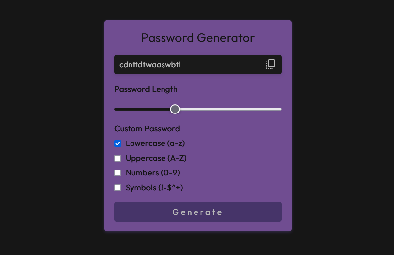

# Password Generator

This is a simple Password Generator created as part of a learning project in web development.

## Table of contents

- [Password Generator](#password-generator)
  - [Table of contents](#table-of-contents)
  - [Overview](#overview)
    - [The challenge](#the-challenge)
    - [Screenshot](#screenshot)
    - [Links](#links)
  - [My process](#my-process)
    - [Built with](#built-with)
  - [Author](#author)

## Overview

### The challenge

Users should be able to:

- View the optimal layout for the app depending on their device's screen size
- See hover states for all interactive elements on the page
- Generate a new password by clicking the generate button
- Select the password length and choose which character types to include (uppercase, lowercase, numbers, and symbols).

### Screenshot

### Links

- [Live Site](https://password-generattor.netlify.app/)

## My process

### Built with

- Semantic HTML5 markup
- CSS custom properties
- Flexbox
- CSS Grid
- Mobile-first workflow
- Javascript

## Author

[Portfolio](https://levymatias.github.io/Portfolio/)
[Linkedin](https://www.linkedin.com/in/levy-matias/)